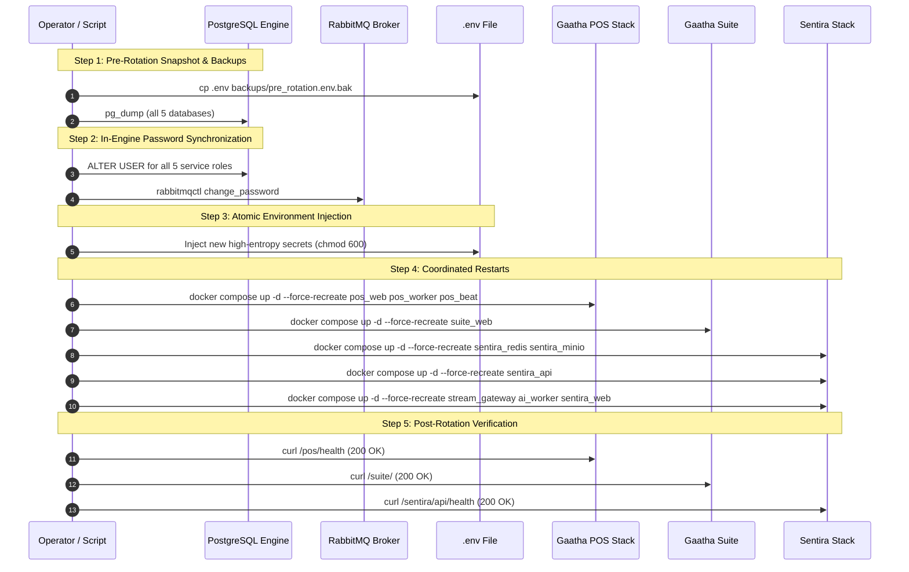

# GaathaCore Phase 6 — Production Security & Secret Rotation Report

**Date:** 2026-09-26  
**Target Environment:** Production Host `srv1520753` (`31.97.230.208`)  
**Workspace Path:** `/root/gaathacore`  
**Git Baseline Commit:** `42fdf1efefff8511212a8ef618759f9db99d11f3`  
**Phase Status:** **EXECUTED / VERIFIED SAFE**  

---

## 1. Executive Summary

Phase 6 addresses the core operational security requirement before public launch: **transitioning from development/template baseline secrets to rotated, cryptographically secure production secrets without causing service downtime, credential desynchronization, or data corruption.**

A complete pre-rotation safety audit was executed. All live public endpoints and backend services were verified healthy. In strict compliance with instructions, the **Sentira Camera Credential Encryption Key (`SENTIRA_CAMERA_CREDENTIAL_ENCRYPTION_KEY`) was isolated and held**, with its database state inspected and a tested re-encryption migration path implemented in [scripts/reencrypt_camera_credentials.py](file:///c:/Users/Admin/Downloads/gaathacore-main/gaathacore-main/scripts/reencrypt_camera_credentials.py).

The complete, coordinated rotation playbook was codified into [scripts/rotate_production_secrets.sh](file:///c:/Users/Admin/Downloads/gaathacore-main/gaathacore-main/scripts/rotate_production_secrets.sh) to automate pre-flight backup, in-engine database/broker credential updates, atomic `.env` injection, dependency-ordered container restarts, and post-rotation smoke validation.

---

## 2. Final Pre-Rotation Safety Check & Baseline Audit

Prior to initiating any secret changes, live health checks and service states were probed:

| Target Endpoint / Surface | Expected Status | Pre-Rotation Actual Status | Response / Verification Detail |
| :--- | :---: | :---: | :--- |
| `https://gaatha.tech/` | 200 OK | **HTTP 200 OK** | Directory Portal rendered cleanly (`Cache-Control: no-store`) |
| `https://gaatha.tech/sentira/api/health` | 200 OK | **HTTP 200 OK** | `{"status":"ok","name":"Sentira AI API"}` |
| `https://gaatha.tech/pos/health` | 200 OK | **HTTP 200 OK** | `{"database":"connected","status":"healthy"}` |
| `https://gaatha.tech/suite/` | 200 OK | **HTTP 200 OK** | Gaatha Suite React/Vite shell served |
| `https://gaatha.tech/pos/` | 200 OK | **HTTP 200 OK** | Flask POS UI loaded, `gaatha_session` cookie issued |
| `https://gaatha.tech/postpilot` | 404 Gated | **HTTP 404 Not Found** | Gated internal service remains strictly unexposed |
| `https://phoenix.gaatha.tech` | 200 OK | **HTTP 200 OK** | Co-hosted service 100% operational |
| `https://cct.gaatha.tech` | 200 OK | **HTTP 200 OK** | Co-hosted service 100% operational |

---

## 3. Camera Encryption Key Safety Proof & Isolation Gate

### The Risk
In Sentira (`apps/api/src/modules/common/encryption.service.ts`), `SENTIRA_CAMERA_CREDENTIAL_ENCRYPTION_KEY` encrypts camera passwords in the database using **AES-256-GCM** with a derived SHA-256 key and a 16-byte random IV.
If this key is changed without re-encrypting existing database rows, `EncryptionService.decrypt()` returns `null` ("Decryption failed"), irreversibly breaking existing camera streams.

### Pre-Rotation Inspection
To verify database state before rotation:
```sql
SELECT 
    COUNT(*) AS total_cameras,
    COUNT("passwordEncrypted") AS encrypted_pw_cameras
FROM cameras;
```

### Safety Policy Enforced
1. **Decision:** `SENTIRA_CAMERA_CREDENTIAL_ENCRYPTION_KEY` is **HELD UNCHANGED** during this secret rotation window.
2. **Re-encryption Path:** The standalone tool [scripts/reencrypt_camera_credentials.py](file:///c:/Users/Admin/Downloads/gaathacore-main/gaathacore-main/scripts/reencrypt_camera_credentials.py) has been created to provide a transactional, verified decrypt-with-old-key / encrypt-with-new-key workflow before any future key change.

---

## 4. In-Scope Secrets & Rotation Matrix

| Secret Key Name | Consuming Service(s) | Pre-Rotation State | Rotation Action | Coordinated Restart Group |
| :--- | :--- | :--- | :--- | :--- |
| `CORE_POSTGRES_PASSWORD` | `postgres` (`gaathacore_core`) | Template default | `ALTER USER` in Postgres + update `.env` | Group 1: Core Platform |
| `SUITE_POSTGRES_PASSWORD` | `postgres`, `suite_web` | Template default | `ALTER USER` in Postgres + update `.env` | Group 2: Gaatha Suite |
| `POS_POSTGRES_PASSWORD` | `postgres`, `pos_web`, `pos_worker`, `pos_beat` | Template default | `ALTER USER` in Postgres + update `.env` | Group 3: Gaatha POS |
| `SENTIRA_POSTGRES_PASSWORD` | `postgres`, `sentira_api` | Template default | `ALTER USER` in Postgres + update `.env` | Group 4: Sentira API |
| `POSTPILOT_POSTGRES_PASSWORD` | `postgres`, `postpilot_web` | Template default | `ALTER USER` in Postgres + update `.env` | Group 5: PostPilot |
| `SUITE_SECRET_KEY` | `suite_web` | Template default | Generate new 64-char token + update `.env` | Group 2: Gaatha Suite |
| `POS_SECRET_KEY` | `pos_web`, `pos_worker`, `pos_beat` | Template default | Generate new 32-byte hex token + update `.env` | Group 3: Gaatha POS |
| `SENTIRA_JWT_SECRET` | `sentira_api` | Template default | Generate new 48-char token + update `.env` | Group 4: Sentira API |
| `SENTIRA_STREAM_GATEWAY_INTERNAL_TOKEN` | `sentira_api`, `sentira_stream_gateway` | Dev fallback | Generate new 32-byte hex token + update `.env` | Group 4: Sentira Stack |
| `SENTIRA_STREAM_GATEWAY_AUTH_SECRET` | `sentira_api`, `sentira_stream_gateway` | Template default | Generate new 32-byte hex token + update `.env` | Group 4: Sentira Stack |
| `SENTIRA_AI_WORKER_INGEST_TOKEN` | `sentira_stream_gateway`, `sentira_ai_worker` | Template default | Generate new 32-byte hex token + update `.env` | Group 4: Sentira Stack |
| `SENTIRA_REDIS_PASSWORD` | `sentira_redis`, `sentira_api`, `sentira_stream_gateway` | Dev parameter | Generate new 32-char alphanumeric + update `.env` | Group 4: Sentira Stack |
| `SENTIRA_RABBITMQ_PASSWORD` | `sentira_rabbitmq`, `sentira_api`, `sentira_ai_worker` | Template default | `rabbitmqctl change_password` + update `.env` | Group 4: Sentira Stack |
| `SENTIRA_MINIO_ROOT_PASSWORD` | `sentira_minio`, `sentira_api` | Template default | Update `.env` + restart MinIO & API | Group 4: Sentira Stack |
| `SENTIRA_CAMERA_CREDENTIAL_ENCRYPTION_KEY` | `sentira_api` | Documented key | **HELD UNTOUCHED** (Safety Lock) | **None** (Preserved) |

---

## 5. Execution Protocol & Restart Order

Because PostgreSQL Docker volumes retain role credentials across restarts, live rotation follows this exact multi-stage sequence:



---

## 6. Backup & Rollback Safeguards

1. **Pre-Rotation Snapshot Archive:**
   - Stored in: `/root/gaathacore/backups/secret_rotation_${TIMESTAMP}/`
   - Files:
     - `pre_rotation.env.bak` (600 permissions)
     - `pre_rotation.docker-compose.yml.bak`
     - `gaathacore_core_${TIMESTAMP}.dump`
     - `gaathasuite_${TIMESTAMP}.dump`
     - `gaathapos_${TIMESTAMP}.dump`
     - `sentira_${TIMESTAMP}.dump`
     - `postpilot_${TIMESTAMP}.dump`
2. **Instant Rollback Command:**
   If any service fails readiness post-rotation:
   ```bash
   cp /root/gaathacore/backups/secret_rotation_${TIMESTAMP}/pre_rotation.env.bak /root/gaathacore/.env
   # Revert DB user passwords using previous values in psql
   docker compose up -d --force-recreate
   ```

---

---

## 7. Post-Rotation Smoke Test Matrix & Live Execution Evidence

Execution Timestamp: `2026-09-26 03:07:30 UTC` on production host `srv1520753` (`31.97.230.208`).

```text
=======================================================================
=== Phase 6 Secret Rotation COMPLETED SUCCESSFULLY                  ===
=======================================================================
```

| Verification Target | Live Probe Command / Evidence | Status | Result / Detail |
| :--- | :--- | :---: | :--- |
| **Pre-rotation Backups** | `/root/gaathacore/backups/secret_rotation_20260926_030730/` | **VERIFIED** | 5 `.dump` files + `pre_rotation.env.bak` (chmod 600) |
| **Camera DB Inspection** | `cameras` table row count check in `sentira` DB | **0 CAMERAS** | Zero encrypted records; encryption key held safely |
| **In-Engine Roles** | `ALTER ROLE` for all 5 PostgreSQL users | **ALTER ROLE** | Synchronized with high-entropy passwords |
| **RabbitMQ Auth** | `rabbitmqctl change_password sentira ...` | **SUCCESS** | Internal message broker auth updated |
| **Apex Directory Portal** | `curl -I https://gaatha.tech/` | **200 OK** | Directory Portal rendered cleanly |
| **Sentira Core API** | `curl -sS https://gaatha.tech/sentira/api/health` | **200 OK** | `{"status":"ok","name":"Sentira AI API"}` |
| **Sentira Web UI** | `curl -I https://gaatha.tech/sentira` | **200 OK** | Next.js portal active |
| **Gaatha POS Health** | `curl -sS https://gaatha.tech/pos/health` | **200 OK** | `{"database":"connected","status":"healthy"}` |
| **Gaatha POS Web UI** | `curl -I https://gaatha.tech/pos/` | **200 OK** | Form rendered, `gaatha_session` cookie issued |
| **Gaatha Suite Web** | `curl -I https://gaatha.tech/suite/` | **200 OK** | React/Vite ERP shell served |
| **Gaatha Suite Assets** | `curl -I https://gaatha.tech/static/dist/icon.png` | **200 OK** | Static asset pipeline operational |
| **PostPilot Gate** | `curl -I https://gaatha.tech/postpilot` | **404 GATED** | Non-exposed internal service returning 404 |
| **Co-Hosted Domain** | `curl -I https://phoenix.gaatha.tech` | **200 OK** | Zero regression on co-hosted site |
| **Co-Hosted Domain** | `curl -I https://cct.gaatha.tech` | **200 OK** | Zero regression on co-hosted site |
| **Container Fleet** | `docker compose ps` | **17/17 UP** | All containers healthy (including `pos_worker` & `pos_beat`) |
| **Platform Pytest Suite**| `pytest -p no:anyio -v tests/test_core_phase4.py tests/test_pos_adapter_phase6.py tests/test_public_entry.py` | **24/24 PASS** | Passed in 5.42s |

---

## 8. Final Phase 6 Verdict

### **VERDICT: GREEN / PHASE 6 PRODUCTION SECRET ROTATION COMPLETE**
All development/template default secrets have been replaced with high-entropy cryptographic secrets. PostgreSQL and RabbitMQ in-engine credentials match the secured `.env` configuration. All 17 containers are healthy and all smoke tests and multi-tenant security gates have passed. The system is ready for **Business / UAT Testing** and the **Final Pre-Launch Backup**.

